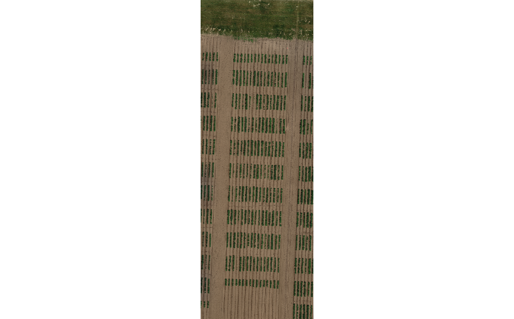
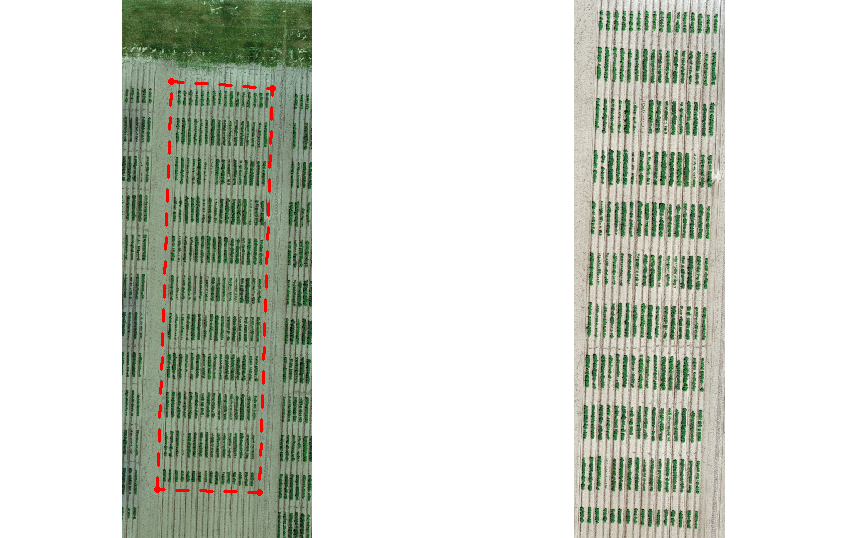
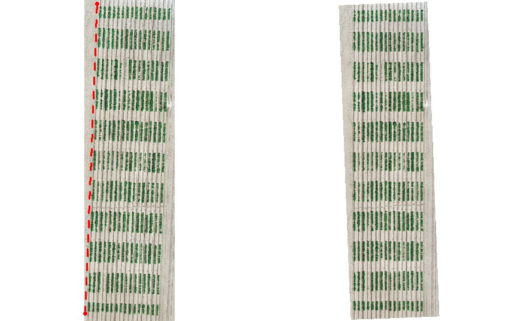
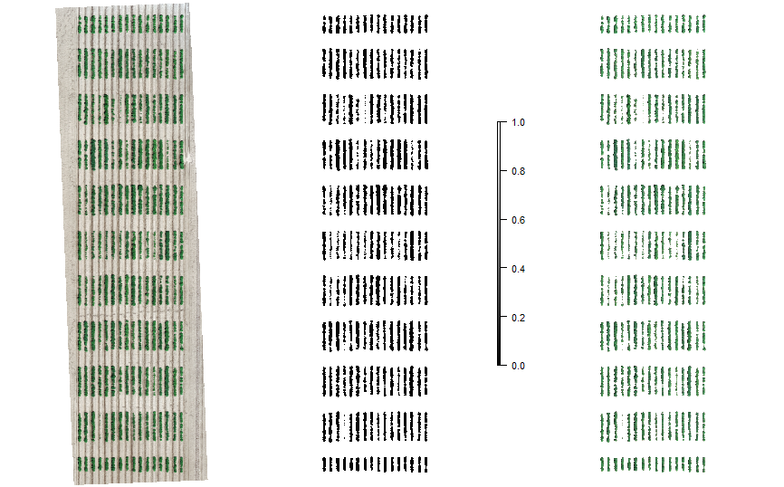
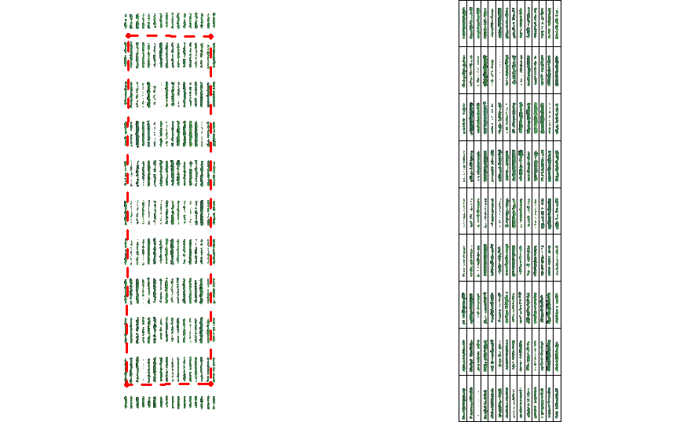

# Analyze-orthomosaic-images-from-agricultural-field-trials

## 1. Load library
```
library(devtools)
library(sp)
library(raster)
library(rgdal)
library(maptools)
library(scales)
library(xml2)
library(git2r)
library(usethis)
library(fftwtools)

devtools::install_github("filipematias23/FIELDimageR")
library(FIELDimageR)
```

## 2. Load image
```
EX1 <- stack("EX1_RGB.tif")
EX1
```
### 2.1 Plot RGB
```
plotRGB(EX1, r = 1, g = 2, b = 3)
```
<!-- -->

### 2.2 Crop image
```
EX1.Crop <- fieldCrop(mosaic = EX1)
```
<!-- -->

## 3. Rotating the image
```
EX1.Rotated<-fieldRotate(mosaic = EX1.Crop, clockwise = F, h=F)
```
<!-- -->

## 4. Removing soil using vegetation indices
```
EX1.RemSoil<- fieldMask(mosaic = EX1.Rotated, Red = 1, Green = 2, Blue = 3, index = "HUE")
```
<!-- -->

## 5. Building the plot shape file
```
EX1.Shape<-fieldShape(mosaic = EX1.RemSoil,ncols = 14, nrows = 9)
```
<!-- -->

## 6. 